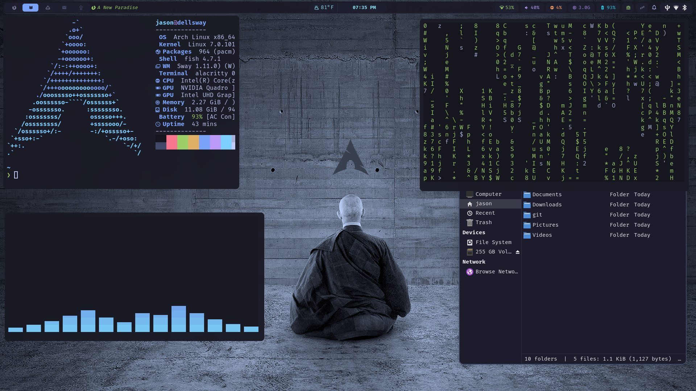

# swaybuild

Arch Linux · SwayFX dotfiles and installer.
Built as a clean alternative to Hyprland — no Lua config files.

**Theme:** Tokyo Night · **Font:** FiraCode Nerd Font · **Cursor:** Bibata Modern Ice



---

## Quick start

```bash
git clone https://github.com/jrabbott34/swaybuild.git
# 1. Install all packages (installs yay if missing)
chmod +x install.sh && ./install.sh

# 2. Deploy configs, apply theming, enable services
chmod +x setup.sh && ./setup.sh

# 3. Log out and select Sway from GDM, or:
dbus-run-session sway
```

### First run checklist

- [ ] Drop wallpapers into `~/Pictures`, then press `Super+Shift+W` to pick one
- [ ] Open **gdm-settings** to theme the GDM login screen (background, cursor, tap-to-click)
- [ ] Open **nwg-look** if you want to change GTK theme, icons, or cursor later
- [ ] Open **pavucontrol** to verify your audio output device

> GTK theme (Catppuccin Mocha), icons (Papirus Dark), and cursor (Bibata Modern Ice)
> are applied automatically by `setup.sh` — no manual nwg-look step needed on first boot.
>
> GDM theming requires **gdm-settings** (included in install.sh). Arch's GDM package only
> creates a group, not a user account, so dconf-based automation doesn't apply.

---

## Components

| Role | Tool |
|------|------|
| Compositor | SwayFX |
| Bar | Waybar |
| Launcher | wofi |
| Notifications | swaync |
| Lock screen | swaylock-effects |
| Logout menu | wlogout |
| Wallpaper daemon | awww + waypaper |
| Display profiles | kanshi |
| Volume/brightness OSD | wob |
| Clipboard manager | cliphist |
| Touchpad gestures | libinput-gestures |
| Night light | wlsunset |
| Idle / screen-off | swayidle |
| File manager | Thunar + Yazi |
| Terminal | Alacritty |
| Shell | Fish + Starship |
| GRUB theme | Tokyo Night (custom) |

---

## Waybar

| Position | Modules |
|----------|---------|
| Left | Workspaces 1–5 · Sway mode indicator · Scratchpad count · MPRIS media |
| Center | Weather · Clock (hover = calendar · click = popup calendar) |
| Right | Network · Audio · CPU · RAM · Battery · Power profile · Idle inhibitor · Notifications · Tray |

**Workspace icons:** 1=󰈹 Firefox · 2=󰄛 Terminal · 3=󱙺 Claude · 4=󰇮 Thunderbird · 5=󰘲 Misc

---

## Key bindings

### Applications

| Binding | Action |
|---------|--------|
| `Super + Return` | Terminal (alacritty) |
| `Super + Space` | App launcher (wofi) |
| `Super + E` | File manager (Thunar) |
| `Super + Shift + Y` | Yazi TUI file manager (floating) |
| `Super + Shift + A` | Cava audio visualizer (floating) |
| `Super + B` | Firefox |
| `Super + Ctrl + L` | Lock screen (swaylock) |

### Screenshots

| Binding | Action |
|---------|--------|
| `Print` | Full screenshot → ~/Pictures |
| `Super + Print` | Area select → annotate in swappy |
| `Super + Shift + Print` | Area select → clipboard |

### Utilities

| Binding | Action |
|---------|--------|
| `Super + V` | Clipboard history (cliphist → wofi) |
| `Super + C` | Color picker (hyprpicker, copies to clipboard) |
| `Super + Shift + B` | Toggle Waybar |
| `Super + Shift + E` | Logout menu (wlogout) |
| `Super + N` | Notification center (swaync) |
| `Super + Shift + W` | Random wallpaper (waypaper) |

### Window management

| Binding | Action |
|---------|--------|
| `Super + Q` | Close window |
| `Super + F` | Fullscreen |
| `Super + Shift + Space` | Toggle floating |
| `Super + A` | Focus parent |
| `Super + \` | Split horizontal |
| `Super + -` | Split vertical |
| `Super + S` | Stacking layout |
| `Super + W` | Tabbed layout |
| `Super + T` | Toggle split layout |
| `Super + Shift + ~` | Move to scratchpad |
| `Super + ~` | Show scratchpad |

### Focus & move

| Binding | Action |
|---------|--------|
| `Super + H/J/K/L` | Focus left/down/up/right |
| `Super + ←/↓/↑/→` | Focus left/down/up/right |
| `Super + Shift + H/J/K/L` | Move window left/down/up/right |
| `Super + Shift + ←/↓/↑/→` | Move window left/down/up/right |

### Resize mode (`Super + R`)

| Binding | Action |
|---------|--------|
| `H/J/K/L` or `←/↓/↑/→` | Shrink/grow width or height |
| `Return` / `Escape` | Exit resize mode |

### Workspaces

| Binding | Action |
|---------|--------|
| `Super + 1–5` | Switch to workspace |
| `Super + Shift + 1–5` | Move window to workspace |

### Media & brightness (Fn keys → wob OSD pill)

| Key | Action |
|-----|--------|
| `XF86AudioRaiseVolume` | Volume +5% |
| `XF86AudioLowerVolume` | Volume -5% |
| `XF86AudioMute` | Toggle mute |
| `XF86AudioMicMute` | Toggle mic mute |
| `XF86MonBrightnessUp` | Brightness +5% |
| `XF86MonBrightnessDown` | Brightness -5% |
| `XF86AudioPlay` | Play / pause |
| `XF86AudioNext` | Next track |
| `XF86AudioPrev` | Previous track |

### Sway

| Binding | Action |
|---------|--------|
| `Super + Shift + R` | Reload Sway config |

---

## Touchpad gestures

| Gesture | Action |
|---------|--------|
| 3-finger swipe left | Next workspace |
| 3-finger swipe right | Previous workspace |
| 4-finger swipe up | New terminal |
| 4-finger swipe down | Logout menu |

---

## Monitor configuration (kanshi)

Display profiles live in `~/.config/kanshi/config` and hot-apply automatically.

| Profile | Outputs |
|---------|---------|
| `laptop` | eDP-1 only (1920×1080) |
| `docked` | DP-5 primary + eDP-1 extended right |
| `closed` | DP-5 only (lid closed) |

To add your own outputs run `swaymsg -t get_outputs` and edit the kanshi config.

---

## Hyprland → Sway replacements

| Hyprland | Sway equivalent |
|----------|----------------|
| `hyprland` | `swayfx` |
| `hyprpaper` | `awww` + `waypaper` |
| `hypridle` | `swayidle` |
| `hyprlock` | `swaylock-effects` |
| `dunst` / `mako` | `swaync` |
| `xdg-desktop-portal-hyprland` | `xdg-desktop-portal-wlr` |
| `swayosd` | `wob` |
